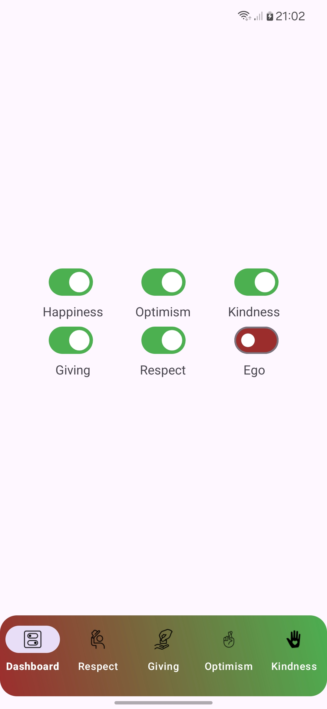
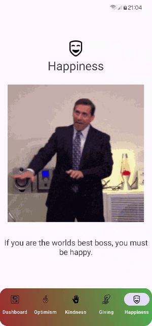
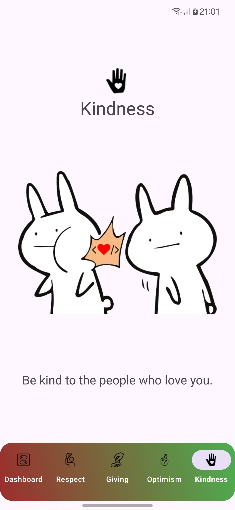

# Disable The Ego

_DisableTheEgo_ is an Android application designed to help users manage and "disable" their ego by focusing on positive traits such as kindness, respect, optimism, happiness, and giving. The app features a dashboard where users can enable or disable different traits, visualize them in a BottomNavigationView, and interact with the app through various fragments.

  

## Table of Contents

- [Features](#features)
- [Installation](#installation)
- [Usage](#usage)
- [Screenshots](#screenshots)
- [Contributing](#contributing)
- [License](#license)
- [Contact](#contact)

## Features

- **Dashboard with Ego Control**: Manage and disable your ego by toggling various positive traits.
- **Dynamic Bottom Navigation**: Customize the BottomNavigationView based on the traits you enable.
- **Smooth Animations**: Enjoy seamless transitions and visual feedback with animations.
- **Multiple Fragments**: Each trait has its dedicated fragment with unique content and visuals.
- **Material Design**: A modern UI designed with Material Design principles for a polished look.

## Installation

### Prerequisites

- **Android Studio**: Download and install [Android Studio](https://developer.android.com/studio).
- **Java Development Kit (JDK)**: Ensure you have JDK 8 or higher installed.

### Cloning the Repository

1. Open your terminal or command prompt.
2. Clone the repository using the following command:

   ```bash
   git clone https://github.com/thwisse/kekod-project-first-week.git
   ```

3. Navigate to the project directory:

   ```bash
   cd DisableTheEgo
   ```

### Setting Up the Project

1. Open Android Studio.
2. Select `Open an existing project`.
3. Navigate to the cloned repository folder and select it.
4. Let Android Studio sync and build the project.

### Running the Application

1. Connect an Android device or start an emulator.
2. Click the `Run` button in Android Studio.
3. Select your device/emulator and click `OK`.

## Usage

### Dashboard Overview

The **Dashboard** is the main screen where you can control various aspects of your ego. Use the switches to enable or disable traits such as **Kindness**, **Respect**, **Optimism**, **Happiness**, and **Giving**. As you toggle these traits, the BottomNavigationView will dynamically update to reflect your current state.

## Contributing

Contributions are welcome! Please follow these steps to contribute:

1. Fork the repository.
2. Create a new branch (`git checkout -b feature/YourFeature`).
3. Make your changes.
4. Commit your changes (`git commit -m 'Add some feature'`).
5. Push to the branch (`git push origin feature/YourFeature`).
6. Open a Pull Request.

Please ensure your code adheres to the project's coding standards and includes appropriate tests.

## License

This project is licensed under the MIT License - see the [LICENSE](LICENSE) file for details.

## Contact

For any inquiries or feedback, please reach out:

- **E-mail**: thwisse@tutanota.com
- **Twitter**: [@thwisse](https://twitter.com/thwisse)